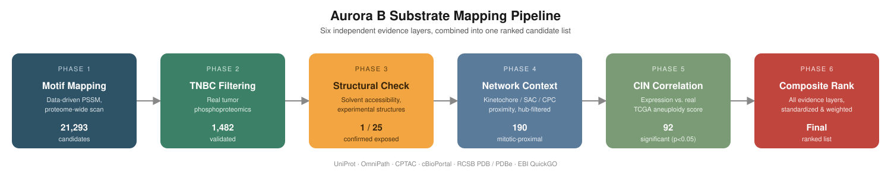
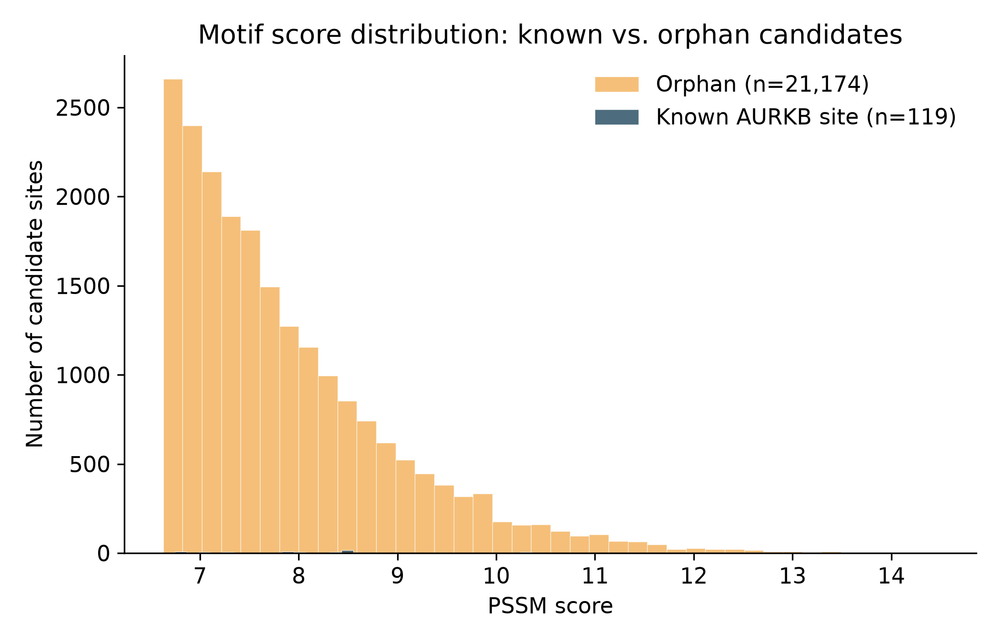
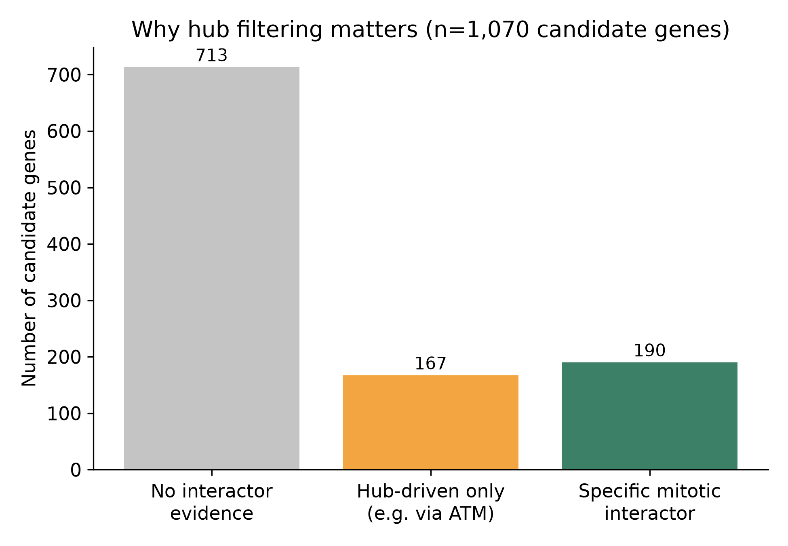
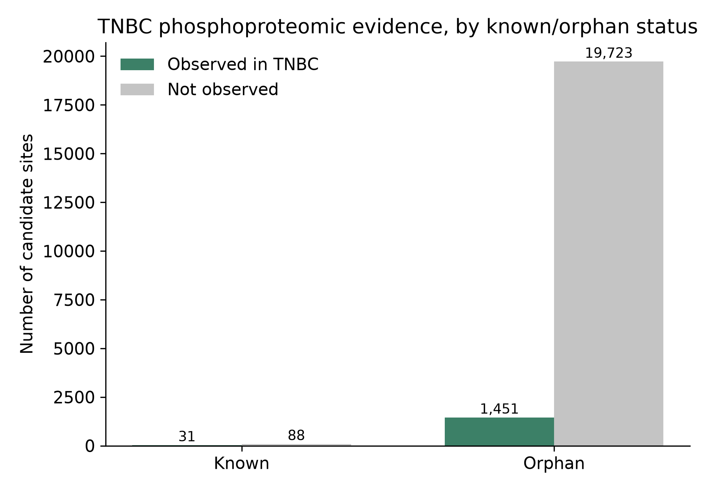
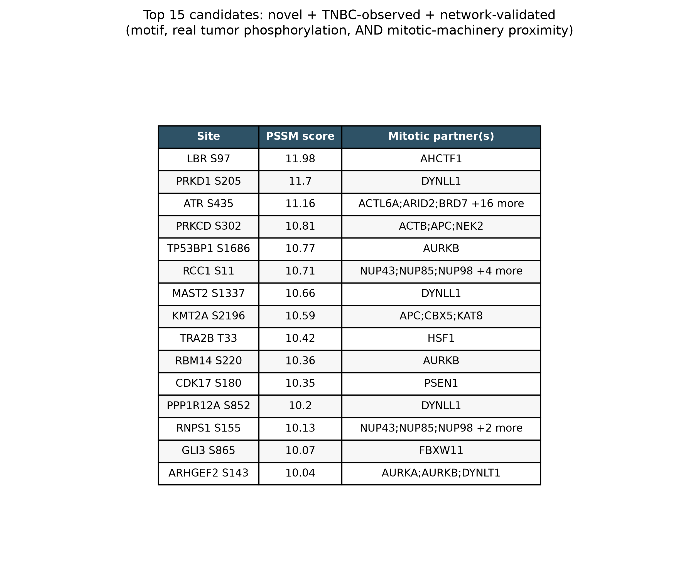

# Aurora B Substrate Mapping in Triple-Negative Breast Cancer


Computational identification of Aurora B kinase substrates driving chromosomal
instability (CIN) in triple-negative breast cancer (TNBC) — a pure dry-lab
pipeline producing a ranked, evidence-backed candidate list for future
experimental validation.



Aurora B is recurrently overactive in TNBC and drives CIN, but most of what it
actually phosphorylates in this specific context is unknown. This project
narrows a proteome-wide list of ~21,000 theoretically plausible sites down to
a small, multi-evidence-backed shortlist, using five independent, real data
sources — no single line of evidence is trusted alone.

## Key result

`data/phase6_composite_ranking.csv` is the final output: every candidate site,
ranked by a composite score combining motif strength, real-tumor
phosphorylation, mitotic network proximity, and clinical CIN correlation.

Headline candidates worth highlighting:
- **NDC80 S55** — a literal core kinetochore component; its N-terminal tail is
  a well-established Aurora B target in the literature. The pipeline
  re-discovered it independently, without that being hard-coded anywhere.
- **KNL1 S1675** — the central spindle-checkpoint signaling scaffold; connects
  directly to AURKB, BUB1, BUB1B, and TTK simultaneously.
- **RGL2 S736** — structurally confirmed surface-exposed (manually verified in
  Mol*, PDB 8B69), on top of real-tumor phosphorylation and motif evidence.






## Pipeline

| Phase | What it does | Key script(s) | Output |
|---|---|---|---|
| 1 | Build a data-driven PSSM from known AURKB sites (OmniPath); scan the human proteome | `phase1_motif_scan.py`, `phase1b_empirical_motif.py` | `aurkb_candidate_sites_pssm.csv` |
| 2 | Cross-reference candidates against real TNBC tumor phosphoproteomics (CPTAC via `cptac` + cBioPortal clinical) | `phase2a`–`phase2f` | `aurkb_candidates_tnbc_filtered.csv` |
| 3 | Check physical plausibility: solvent accessibility from experimental structures (PDBe/RCSB) | `phase3b_structural_coverage.py` | `phase3_structural_coverage.csv` |
| 4 | Check proximity to known mitotic fidelity machinery (kinetochore/SAC/CPC via GO + OmniPath), hub-filtered | `phase4a_mitotic_network.py`, `phase4b_figures.py` | `aurkb_candidates_network_context.csv` |
| 5 | Correlate candidate expression against real chromosomal instability metrics (TCGA-BRCA, cBioPortal) | `phase5a_tcga_cin_recon.py`, `phase5b_tcga_correlation.py` | `phase5_cin_correlation.csv` |
| 6 | Combine all evidence layers into one standardized composite score | `phase6_composite_ranking.py` | **`phase6_composite_ranking.csv`** |

Note: an AlphaFold-Multimer docking approach was attempted for Phase 3
(`phase3a_colabfold_prep.py`) but dropped in favor of the faster structural-
coverage check above, due to compute/tooling constraints.
## Setup

```bash
conda create -n aurora-b python=3.11
conda activate aurora-b
pip install -r requirements.txt
```

## Running the pipeline

All scripts live in `scripts/`. Each prints its own diagnostics — run in
order, redirect output into `outputs/`, and read each log before moving to
the next phase:

```bash
python scripts/phase1_motif_scan.py > outputs/phase1_output.txt 2>&1
python scripts/phase1b_empirical_motif.py > outputs/phase1b_output.txt 2>&1
python scripts/phase2a_cptac_explore.py > outputs/phase2a_output.txt 2>&1
python scripts/phase2b_cbioportal_clinical.py > outputs/phase2b_output.txt 2>&1
python scripts/phase2c_tnbc_sample_list.py > outputs/phase2c_output.txt 2>&1
python scripts/phase2d_phospho_recon.py > outputs/phase2d_output.txt 2>&1
python scripts/phase2e_phospho_filter.py > outputs/phase2e_output.txt 2>&1
python scripts/phase2f_figures.py > outputs/phase2f_output.txt 2>&1
python scripts/phase3b_structural_coverage.py > outputs/phase3b_output.txt 2>&1
python scripts/phase4a_mitotic_network.py > outputs/phase4a_output.txt 2>&1
python scripts/phase4b_figures.py > outputs/phase4b_output.txt 2>&1
python scripts/phase5a_tcga_cin_recon.py > outputs/phase5a_output.txt 2>&1
python scripts/phase5b_tcga_correlation.py > outputs/phase5b_output.txt 2>&1
python scripts/phase6_composite_ranking.py > outputs/phase6_output.txt 2>&1
```

## Repository structure

```
data/       generated CSVs (candidate lists, clinical joins, correlations)
figures/    generated PNGs
outputs/    console log from each script run, for reproducibility
scripts/    one script per pipeline step, in run order
```

## Limitations (read before citing any single number)

- **Phase 1**: the PSSM's recovery rate is measured on the same known sites
  used to build it — an internal consistency check, not a generalization
  estimate.
- **Phase 2**: TNBC status comes from a 122-patient CPTAC cohort annotated via
  cBioPortal, not a larger clinical trial population.
- **Phase 3**: structural coverage was only checked for the top 25 orphan
  candidates; most large, disordered nuclear/splicing proteins on this list
  have no experimental structure at all — absence of a structure is treated
  as inconclusive, not disqualifying.
- **Phase 4**: the mitotic-machinery reference set is built live from GO
  annotations; broadly-connected "hub" proteins (e.g. ATM) were explicitly
  excluded from counting as evidence, since they connect to almost anything.
- **Phase 5**: "Basal-like" PAM50 subtype is used as a TNBC proxy (this TCGA
  release doesn't include IHC receptor status directly) — overlapping with,
  but not identical to, clinical TNBC. Correlation p-values are **not**
  corrected for multiple testing across ~1,063 genes; at p<0.05, roughly 53
  "significant" hits would appear by chance alone, so no single gene's
  p-value should be read in isolation.
- **Phase 6**: composite weights (50% motif / 25% network / 25% CIN
  correlation) are a documented, adjustable choice, not a validated ground
  truth — change them in `phase6_composite_ranking.py` and rerun if you'd
  weight the evidence differently.

## Data sources

[UniProt](https://www.uniprot.org) · [OmniPath](https://omnipathdb.org) ·
[CPTAC](https://proteomic.datacommons.cancer.gov) (via the `cptac` package) ·
[cBioPortal](https://www.cbioportal.org) (`brca_cptac_2020`,
`brca_tcga_pan_can_atlas_2018`) · [RCSB PDB](https://www.rcsb.org) /
[PDBe SIFTS](https://www.ebi.ac.uk/pdbe) ·
[EBI QuickGO](https://www.ebi.ac.uk/QuickGO)

## Citation

If you use this pipeline or its output candidate list, please cite this
repository — see `CITATION.cff` 

## License

MIT — see `LICENSE`.

## Status

Phases 1–6 complete. Natural next steps: full AlphaFold-Multimer docking of
top candidates against the AURKB–INCENP complex (compute-permitting), and
wet-lab validation of the top composite-ranked candidates.
---
